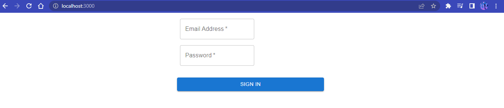

### LOGIN PAGE

**Name:** Kristhian David Segura

## How to use?

```
    npm install next react react-dom
```

```
    npm install @mui/material @emotion/react @emotion/styled
```

```
    npm run dev
```


